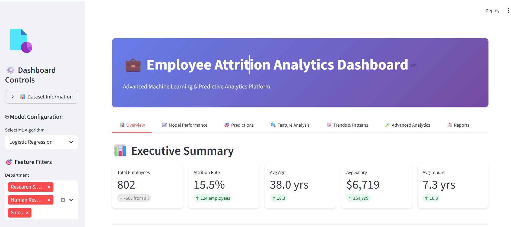
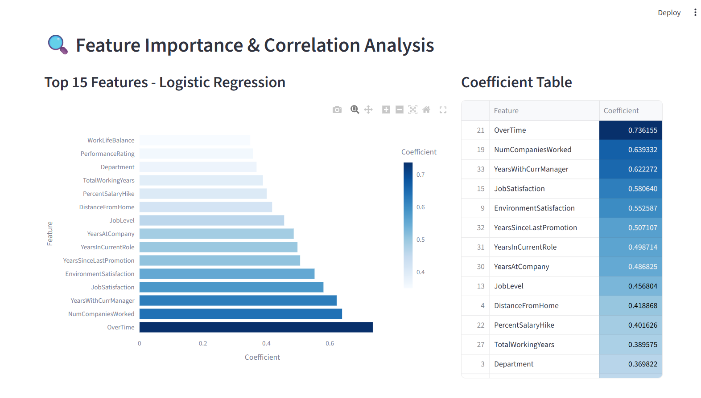
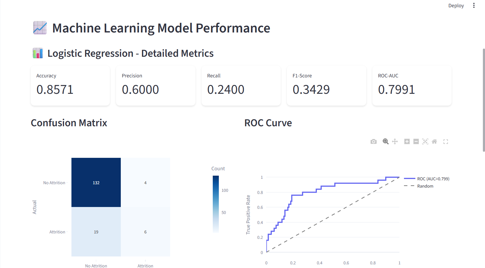

# 👩‍💼 Employee Attrition Predictive Analytics Dashboard

[](https://www.python.org/)
[](https://streamlit.io/)
[](https://www.kaggle.com/code/haarinisk22mid0231/predictive/)
[](LICENSE)

An **interactive analytics system** for predicting employee attrition, exploring workforce trends, and visualizing HR insights using **Machine Learning** and **Streamlit Dashboard**.

---

## 📋 Table of Contents
- [Overview](#-overview)
- [Academic Context](#-academic-context)
- [Features](#-features)
- [Technology Stack](#-technology-stack)
- [Installation](#-installation)
- [Usage](#-usage)
- [Project Structure](#-project-structure)
- [Model Performance](#-model-performance)
- [Screenshots](#-screenshots)
- [Contributing](#-contributing)
- [License](#-license)
- [Contact](#-contact)

---

## 🎯 Overview

Employee attrition (turnover) is a major challenge for organizations that seek to retain skilled workers.  
This project applies **machine learning** and **predictive analytics** to forecast attrition risk, analyze factors influencing turnover, and visualize workforce data trends.

The dashboard is powered by **Logistic Regression**, the best-performing model among seven tested algorithms, providing interpretable insights into attrition factors.

---

## 🎓 Academic Context

This project was developed as part of a **Machine Learning and Predictive Analytics** coursework.  
It demonstrates the practical use of:

- Supervised learning (classification)
- Feature importance analysis
- HR data visualization
- Predictive modeling
- Streamlit web deployment

---

## 🧩 Features

### 📊 1. Statistical Analysis Module
- View attrition rates by department, gender, and age group  
- Explore distributions of key HR attributes  
- Generate correlation heatmaps and demographic breakdowns  

### 🔮 2. Machine Learning Prediction Module
- Train and compare **7 classification models**  
- Automatically identify the **best-performing model**  
- View performance metrics: Accuracy, F1, ROC-AUC  

### 💼 3. Employee Attrition Dashboard
- Upload HR dataset (CSV)  
- Compare multiple features interactively  
- Explore top attrition factors visually  
- Predict whether an employee is likely to leave  

### 📈 4. Visualization Suite
- Confusion Matrix Heatmap  
- ROC Curve  
- Top 10 Important Features  
- Boxplots and Trend Comparisons  

---

## 🛠️ Technology Stack

### Backend
- **Python 3.10+**
- **Pandas**, **NumPy**
- **Scikit-learn** (Machine Learning)
- **Matplotlib**, **Seaborn**, **Plotly** (Visualization)

### Frontend
- **Streamlit** - Web-based dashboard interface
- **HTML / CSS** (built-in with Streamlit)

### Machine Learning Models
1. Logistic Regression ⭐ (Best Model)
2. Random Forest
3. XGBoost
4. Decision Tree
5. SVM
6. KNN
7. Naive Bayes

---

## 📦 Installation

### Prerequisites
- Python 3.10 or higher  
- pip package manager  

### Step 1: Clone Repository
```bash
git clone https://github.com/Haarini2164/EMPLOYEE-ATTRITION-PREDICTION.git
cd EMPLOYEE-ATTRITION-PREDICTION
````

### Step 2: Install Dependencies

```bash
pip install -r requirements.txt
```

### Step 3: Run Streamlit App

```bash
streamlit run logistic_regression_dashboard.py
```

The dashboard will open at [http://localhost:8501](http://localhost:8501)

---

## 🚀 Usage

1. **Upload Dataset**

   * Upload `WA_Fn-UseC_-HR-Employee-Attrition.csv`
   * Dataset auto-loads and displays preview

2. **Explore Data**

   * Use sidebar filters to explore attributes
   * View attrition by department, job role, or satisfaction

3. **Model Analysis**

   * Evaluate all models trained in the notebook
   * Compare metrics and identify top performers

4. **Interactive Predictions**

   * Input new employee features
   * Dashboard predicts likelihood of attrition

---

## 📁 Project Structure

```
EMPLOYEE-ATTRITION-PREDICTION/
│
├── logistic_regression_dashboard.py      # Streamlit dashboard code
├── predictive.ipynb                      # Kaggle notebook (7 ML models)
├── WA_Fn-UseC_-HR-Employee-Attrition.csv # Dataset
├── requirements.txt                      # Dependencies
└── README.md                             # Documentation
```

---

## 📊 Model Performance

| Model               | Accuracy  | F1 Score  | ROC-AUC   |
| ------------------- | --------- | --------- | --------- |
| Logistic Regression | **0.874** | **0.493** | **0.805** |
| Decision Tree       | 0.847     | 0.210     | 0.711     |
| Random Forest       | 0.837     | 0.111     | 0.791     |
| XGBoost             | 0.863     | 0.411     | 0.778     |
| SVM                 | 0.863     | 0.333     | 0.810     |
| KNN                 | 0.840     | 0.078     | 0.699     |
| Gradient Boosting   | 0.833     | 0.222     | 0.781     |

---

## 📸 Screenshots

### 🖥️ Dashboard Overview



### 📊 Feature Analysis



### ⭐ Feature Importance



> 💡 Each dashboard section provides an interactive, visual interpretation of employee attrition data, allowing HR professionals to identify key retention strategies.

---

## 🤝 Contributing

Contributions are welcome!

1. Fork the repository
2. Create your feature branch

   ```bash
   git checkout -b feature/your-feature
   ```
3. Commit your changes

   ```bash
   git commit -m "Add: your feature description"
   ```
4. Push to branch

   ```bash
   git push origin feature/your-feature
   ```
5. Open a Pull Request

### Development Guidelines

* Follow PEP 8 code style
* Use meaningful variable names
* Add comments for clarity
* Test before submitting PR

---

## 🐛 Known Issues & Limitations

* Limited to static dataset (no live HR database)
* Predictions depend on quality of input data
* Dashboard optimized for desktop screens

---

## 📄 License

This project is licensed under the **MIT License** – see the LICENSE file for details.

```
MIT License  
Copyright (c) 2025 Haarini  
Permission is hereby granted, free of charge, to any person obtaining a copy
of this software and associated documentation files (the "Software"), to deal
in the Software without restriction...
```

---

## 📧 Contact

**Author:** Haarini S.K.
📩 Email: [haarinisk22mid0231@gmail.com](mailto:haarinisk22mid0231@gmail.com)
🌐 GitHub: [@Haarini2164](https://github.com/Haarini2164)
📊 Kaggle: [haarinisk22mid0231](https://www.kaggle.com/code/haarinisk22mid0231/predictive/)

**Project Link:**
🔗 [https://github.com/Haarini2164/EMPLOYEE-ATTRITION-PREDICTION](https://github.com/Haarini2164/EMPLOYEE-ATTRITION-PREDICTION)

---

⭐ **If you found this project useful, please give it a star!**
*Built with ❤️ to empower HR decision-making through data-driven insights.*

